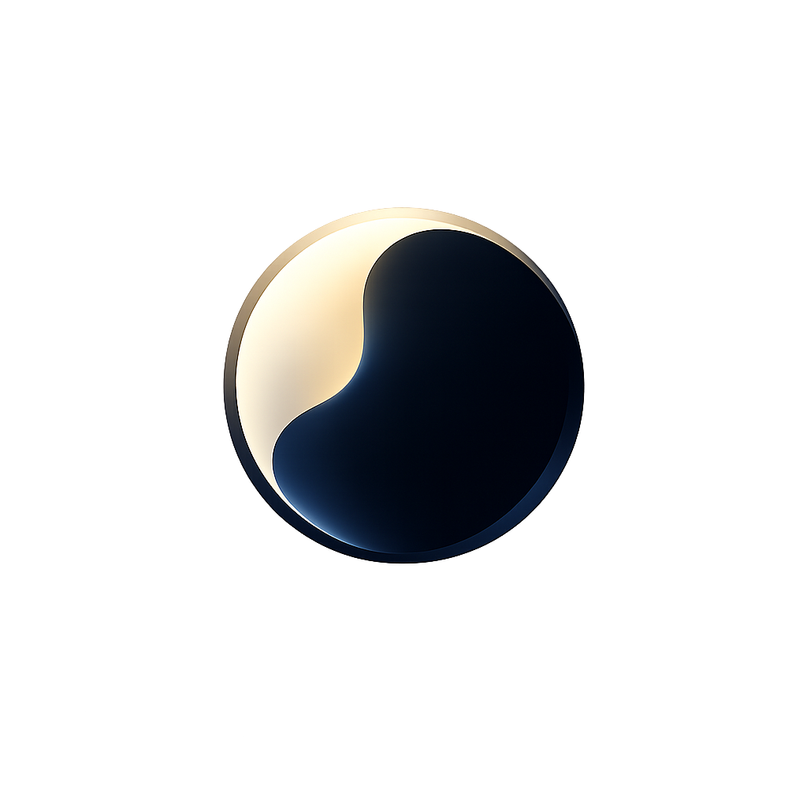

<div align="center">
  
  <h1 style="font-family: 'Söhne', 'Inter', sans-serif; margin-bottom: 0;">Luma</h1>
  <p style="font-family: 'Söhne', 'Inter', sans-serif; font-weight: 300; font-size: 1.2rem; color: #888;">
    A cinematic photodiode explainer demo.
  </p>
</div>

---

**Luma** is a premium, minimalist interactive web application designed to visually explain how a photodiode converts incident light into an electrical signal. Engineered as a continuous cinematic drift rather than a traditional section-based site, Luma relies on scroll-linked narratives to explore semiconductor structure, reverse bias physics, and photocurrent generation.

## 🎯 Learning Objectives

The experience is centered around creating a highly intuitive scientific visualization without dense textbook clutter. By progressing through Luma, users will understand:

- **Internal Structure**: The architecture of a p-n junction (p-type, n-type, and the central depletion region).
- **Reverse Bias Operation**: The physical effect of applying reverse bias to widen the active region and improve response speed.
- **Photogeneration Physics**: How incident photons generate electron-hole pairs precisely within the depletion region.
- **Dynamic Photocurrent**: How directly increasing incident light intensity scales the photocurrent, separated from the device's dark current.
- **Signal Detection**: The process of translating an optical data pulse train into a synchronized electrical waveform.
- **Real-World Applications**: Bridging the theoretical physics to practical utilities like fiber-optic networks, smoke detectors, and IR receivers.

## ✨ Features

- **Seamless Cinematic Progression**: Driven by Framer Motion, 15 scientific scenes blend seamlessly without forced layout cuts or jarring boundaries.
- **Pseudo-3D Visualizations**: Highly optimized 2.5D layered semiconductor cutaways utilizing CSS depth transformations.
- **Automated Scroll Physics**: A strict scroll-linked engine replaces manual controls, directly mapping physical scroll progress to variable adjustments (like expanding the depletion region and plotting graphical lines natively).
- **Responsiveness**: A fully responsive application crafted for pristine viewing across both desktop and mobile viewports.
- **Refined Ambience**: Soft acoustic feedback generated with Howler.js, mapping tactile UI interactions with satisfying soundscapes.

## 🚀 Deployment

Luma is optimized for Vercel and built on top of the modern Next.js `app` router system.

```bash
# 1. Install all dependencies
npm install

# 2. Run the local development server
npm run dev

# 3. Build for production (Output verified strictly optimized)
npm run build
```

<div align="center" style="margin-top: 40px; font-family: 'Söhne', 'Inter', sans-serif; font-size: 0.9rem; color: #666;">
  <i>Engineered with Next.js, React, Tailwind CSS v4, Zustand, and Framer Motion.</i>
</div>
